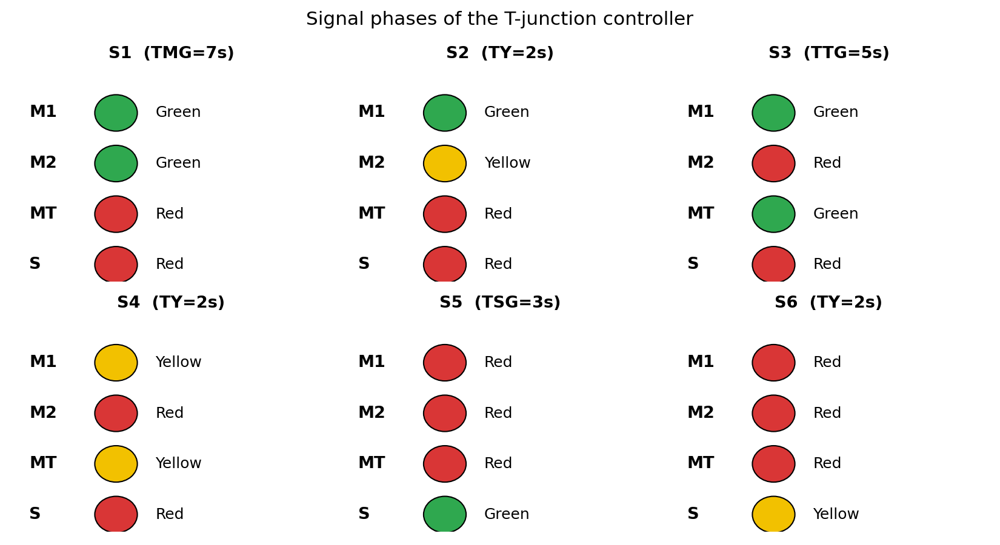
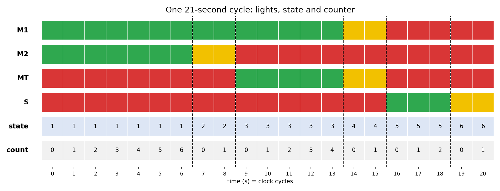
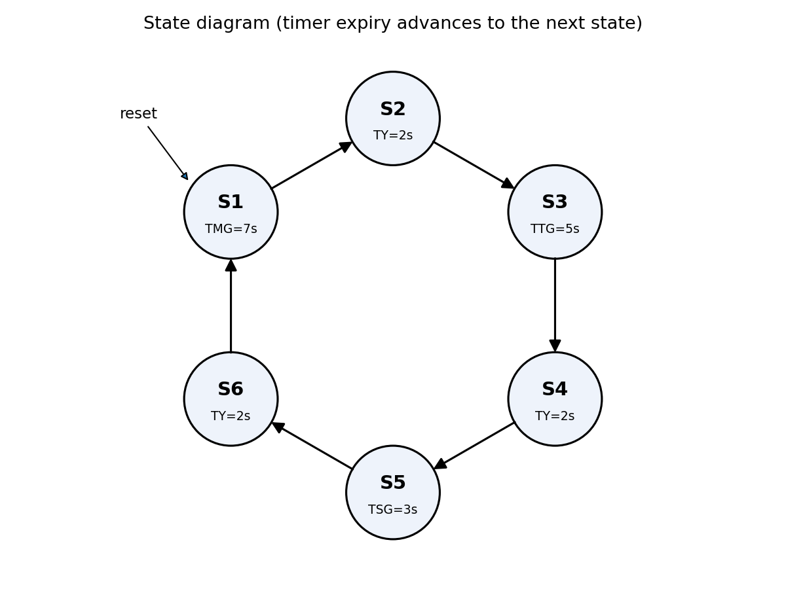
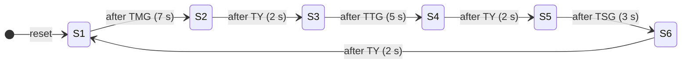

# Traffic Light Controller for a T-Junction (Verilog)

A fixed-time traffic light controller for a **T-shaped road junction**, written in synthesizable Verilog as a six-state Moore finite state machine (FSM). The repository contains the RTL, a self-checking testbench, a Makefile for simulation with open-source tools, and design documentation.

## Table of contents

1. [Overview](#overview)
2. [Junction and movements](#junction-and-movements)
3. [Signal phases](#signal-phases)
4. [State diagram](#state-diagram)
5. [Design](#design)
6. [Repository structure](#repository-structure)
7. [Getting started](#getting-started)
8. [Verification](#verification)
9. [Customising the timing](#customising-the-timing)
10. [Limitations and future work](#limitations-and-future-work)
11. [License](#license)

## Overview

| Item | Value |
|---|---|
| Language | Verilog (IEEE 1364-2005) |
| Module | `Traffic_Light_Controller` |
| Architecture | Moore FSM with a cycle counter |
| States | 6 (S1 to S6) |
| Cycle length | 21 clock cycles (21 s when one cycle = 1 s) |
| Reset | Asynchronous, active high |
| Inputs | `clk`, `rst` |
| Outputs | `light_M1`, `light_MT`, `light_M2`, `light_S` (3 bits each) |

The controller runs a fixed sequence. Each phase gives green to a set of movements that do not conflict, then a yellow phase clears the junction before the next phase begins. There are no sensors, so the timings are constant.

## Junction and movements

Four traffic movements are controlled:

| Signal | Movement |
|---|---|
| `M1` | Main road, through traffic in one direction |
| `M2` | Main road, through traffic in the opposite direction |
| `MT` | Main road, traffic turning into the side road |
| `S` | Side road, traffic joining the main road |

```
          main road
  ──────────────────────────────────────
     M1  ──────────────────────────▶
     M2  ◀──────────────────────────
     MT  ◀───────────┐  (turns into side road)
                     ▼
                 ┌───┴───┐
                 │   S   │  side road, joins main road
                 └───────┘
```

## Signal phases

Light values are encoded as `{Red, Yellow, Green}` per output: `100` = red, `010` = yellow, `001` = green.

| State | Duration | Parameter | M1 | M2 | MT | S | Description |
|---|---|---|---|---|---|---|---|
| S1 | 7 s | `TMG` | G | G | R | R | Main road flows in both directions |
| S2 | 2 s | `TY` | G | Y | R | R | M2 clears out |
| S3 | 5 s | `TTG` | G | R | G | R | M1 continues, main-road turn is released |
| S4 | 2 s | `TY` | Y | R | Y | R | M1 and MT clear out |
| S5 | 3 s | `TSG` | R | R | R | G | Side road released |
| S6 | 2 s | `TY` | R | R | R | Y | Side road clears out |

Total cycle: 7 + 2 + 5 + 2 + 3 + 2 = **21 seconds**, then back to S1.





The same timeline as text (one column per second, G = green, Y = yellow, R = red; the last row is the state number):

```
second  0 1 2 3 4 5 6 7 8 9 0 1 2 3 4 5 6 7 8 9 0
M1      G G G G G G G G G G G G G G Y Y R R R R R
M2      G G G G G G G Y Y R R R R R R R R R R R R
MT      R R R R R R R R R G G G G G Y Y R R R R R
S       R R R R R R R R R R R R R R R R G G G Y Y
state   1 1 1 1 1 1 1 2 2 3 3 3 3 3 4 4 5 5 5 6 6
```

## State diagram



The same diagram in Mermaid, which GitHub renders directly:



Each state remains active until its timer expires, then the FSM advances to the next state. The state sequence never changes.

## Design

### Block structure

```
          ┌────────────────────────────────────────────┐
 clk ────▶│  State register (ps)  +  cycle counter     │
 rst ────▶│                                            │
          │   limit  ◀── duration lookup (ps)          │
          │   ns     ◀── next-state logic (ps)         │
          └───────────────┬────────────────────────────┘
                          │ ps
                          ▼
                 Output logic (Moore)
                          │
       ┌───────────┬──────┴─────┬───────────┐
   light_M1    light_MT     light_M2     light_S
```

### How the timer works

`count` starts at 0 when a state is entered. Each clock cycle it increments. When `count == limit - 1`, the FSM moves to the next state and `count` clears to 0. A state with `limit = N` therefore lasts exactly **N clock cycles**.

### Ports

| Port | Direction | Width | Description |
|---|---|---|---|
| `clk` | input | 1 | Clock. One cycle represents one second |
| `rst` | input | 1 | Asynchronous reset, active high. Returns the FSM to S1 |
| `light_M1` | output | 3 | Main road, through (RYG) |
| `light_MT` | output | 3 | Main road, turn into side road (RYG) |
| `light_M2` | output | 3 | Main road, opposite through (RYG) |
| `light_S` | output | 3 | Side road (RYG) |

### Parameters

| Parameter | Default | Meaning |
|---|---|---|
| `TMG` | 7 | S1 duration in cycles |
| `TY` | 2 | S2, S4 and S6 duration in cycles |
| `TTG` | 5 | S3 duration in cycles |
| `TSG` | 3 | S5 duration in cycles |

### State encoding

| State | Code |
|---|---|
| S1 | `3'd0` |
| S2 | `3'd1` |
| S3 | `3'd2` |
| S4 | `3'd3` |
| S5 | `3'd4` |
| S6 | `3'd5` |
| unused | `3'd6`, `3'd7` fall to `default`: next state S1, all lights red |

See [`docs/design.md`](docs/design.md) for the state table, design decisions and timing details.

## Repository structure

```
.
├── traffic_light_controller.v          # Design under test (RTL)
├── traffic_light_controller_tb.v       # Self-checking testbench
├── phases.png                          # Signal phases diagram
├── timing_diagram.png                  # 21-second timing diagram
├── state_diagram.png                   # State diagram
├── Makefile                            # Build and simulate with Icarus Verilog
├── docs/
│   ├── design.md                       # State table and design notes
│   └── make_diagrams.py                # Regenerates the three PNGs
├── .gitignore
├── LICENSE
└── README.md
```

## Getting started

### Option A: Icarus Verilog and GTKWave (open source)

Install [Icarus Verilog](https://steveicarus.github.io/iverilog/) and optionally [GTKWave](https://gtkwave.sourceforge.net/), then from the repository root:

```bash
make sim      # compile and run the self-checking testbench
make wave     # open the waveform in GTKWave (needs GTKWave installed)
make clean    # remove build output
```

### Option B: Xilinx Vivado / ISE simulator

1. Create a new project and add `traffic_light_controller.v` as a design source.
2. Add `traffic_light_controller_tb.v` as a simulation source.
3. Set `Traffic_Light_Controller_TB` as the top simulation module and run the behavioural simulation.

The testbench writes a `build/waves.vcd` file. If that folder does not exist in your tool's working directory, remove or edit the `$dumpfile` line in the testbench.

## Verification

> The diagrams in this README are generated from the same timing model as the RTL by `docs/make_diagrams.py`. They are not simulator screenshots. After running your own simulation (`make wave`), you can add a real waveform screenshot (for example `waveform.png`) to the repo root and link it here.

The testbench (`traffic_light_controller_tb.v`) is self-checking and uses a 10 ns clock where one cycle stands for one second. It checks:

- **State durations:** S1 to S6 last 7, 2, 5, 2, 3 and 2 cycles respectively.
- **Light outputs:** all four outputs match the phase table in every state.
- **Reset recovery:** a reset applied mid-run returns the FSM to S1 with the counter at 0.
- **Repetition:** three full cycles run, then one more full cycle after the reset.

The simulation prints one line per completed state, followed by a final `PASS` or `FAIL` summary. A passing run looks like this (the times will differ):

```
ok   t=...: S1 lasted 7 s
ok   t=...: S2 lasted 2 s
ok   t=...: S3 lasted 5 s
...
PASS: <N> checks, 0 errors
```

## Customising the timing

The durations are module parameters, so you can override them when instantiating the controller without editing the RTL:

```verilog
Traffic_Light_Controller #(
    .TMG(4'd10),
    .TY (4'd3),
    .TTG(4'd6),
    .TSG(4'd4)
) u_tlc (
    .clk(clk), .rst(rst),
    .light_M1(m1), .light_MT(mt), .light_M2(m2), .light_S(s)
);
```

Notes:

- Each duration must be at least 1 and at most 15, because the counter is 4 bits wide.
- If you change the durations, update the expected values in the testbench as well.

### Running on an FPGA

On hardware the clock is far faster than 1 Hz. To get a real one-second step, divide the board clock down to 1 Hz with a separate clock-enable or divider module in front of this controller. The controller itself is clock-agnostic.

## Limitations and future work

- Fixed timings: green times cannot adapt to traffic density.
- No all-red clearance interval between phases beyond the yellow phases.
- No pedestrian crossing phase.
- Possible extensions:
  - Vehicle detection sensors that extend or skip a green phase.
  - Pedestrian request buttons and walk signals.
  - Emergency-vehicle pre-emption input.
  - Flashing-yellow or all-red fault mode.
  - Built-in clock divider and an FPGA constraints file for a specific board.

## License

Released under the MIT License. See [`LICENSE`](LICENSE).

## Author

Replace this line with your name, degree/institution and a link to your GitHub profile.
